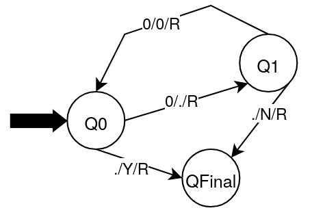

# 0^(2n) Language Turing Machine

A Turing machine implementation that determines whether a string belongs to the language L = {0^(2n) | n ≥ 0}.

## Overview

This Turing machine checks if an input string contains an **even number** of 0's. It verifies strings where the length is 2n (0, 2, 4, 6, 8, ...), and outputs:
- **Y** (Yes) if the string has an even number of zeros (including 0)
- **N** (No) if the string has an odd number of zeros

## Machine Specification

- **Input alphabet**: `[0]`
- **Blank Symbol**: `[.]`
- **Alphabet**: `[0, Y, N] + [.]`
- **Initial State**: `q0`
- **Final State**: `HALT`
- **States**: `q0, q1, HALT`

## How It Works

The machine uses a simple parity-checking strategy that processes pairs of 0's:

1. **Mark First 0**: In state q0, read a '0', mark it (replace with '.'), move right to q1
2. **Skip Second 0**: In state q1, read a '0', keep it, move right back to q0
3. **Repeat**: Continue marking every other '0' (processing pairs)
4. **Check End**:
   - If q0 reaches blank: all 0's were successfully paired (even count) → Accept with 'Y'
   - If q1 reaches blank: one unpaired 0 remains (odd count) → Reject with 'N'

The algorithm alternates between two states, effectively counting by 2's. If we can completely pair all symbols, the count is even (2n for some n ≥ 0).

### State Descriptions

- **q0**: Even parity state - expects to find pairs of 0's
  - If '0': mark it (first of a pair) and move to q1
  - If '.': reached end with even count → accept with 'Y'
- **q1**: Odd parity state - just processed one 0, needs another to complete the pair
  - If '0': keep it (second of a pair) and return to q0
  - If '.': reached end with odd count → reject with 'N'
- **HALT**: Final halting state

## State Transition Diagram

  

## Transition Table

| Current State | Next State  | Read Symbol | Write Symbol | Move Direction |
|:-------------:|:-----------:|:-----------:|:------------:|:--------------:|
| q0 | q1 | 0 | . | RIGHT  |
| q0 | HALT | . | Y | RIGHT  |
| q1 | q0 | 0 | 0 | RIGHT  |
| q1 | HALT | . | N | RIGHT  |

## Example Executions

WAITING PROGRAM TO RUN MACHINE AND PUT EXEMPLE IN THE MARKDOWN

## Valid Input Patterns

### Accepted Strings (Output: Y)
- `` (empty string, 2×0 = 0)
- `00` (2×1 = 2)
- `0000` (2×2 = 4)
- `000000` (2×3 = 6)
- `00000000` (2×4 = 8)
- `0000000000` (2×5 = 10)

**Pattern**: Any string with an even number of 0's

### Rejected Strings (Output: N)
- `0` (1)
- `000` (3)
- `00000` (5)
- `0000000` (7)
- `000000000` (9)

**Pattern**: Any string with an odd number of 0's

## Usage

To run this Turing machine:

1. Load the `02n.json` configuration file
2. Provide an input string composed only of '0' characters
3. The machine will process the string and halt with either 'Y' or 'N' on the tape

## Implementation Notes

- The machine uses the blank symbol (`.`) to mark processed positions
- Empty string is accepted (0 is an even number)
- The algorithm effectively performs modulo 2 arithmetic
- Result ('Y' or 'N') is written at the right of the rightmost character as specified

## Language Notation

The notation **0^(2n)** means:
- 0^k where k = 2n for some non-negative integer n
- In other words: strings of 0's with even length
- This is equivalent to the language: {ε, 00, 0000, 000000, ...}

Where:
- n = 0 → 0^(2×0) = 0^0 = ε (empty string)
- n = 1 → 0^(2×1) = 0^2 = 00
- n = 2 → 0^(2×2) = 0^4 = 0000
- n = 3 → 0^(2×3) = 0^6 = 000000
