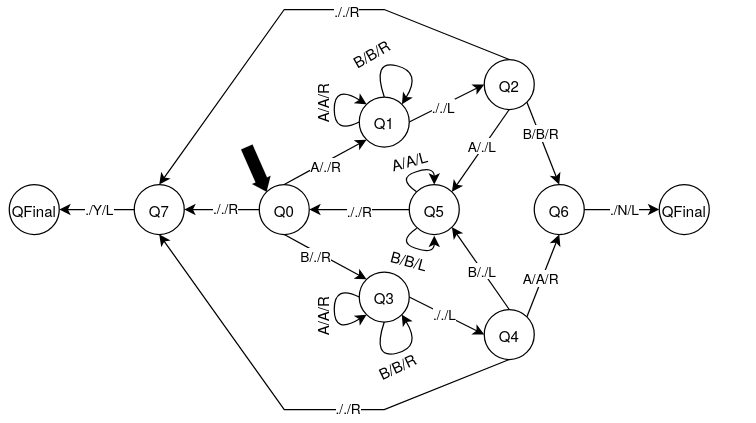

# Palindrome Turing Machine

A Turing machine implementation that determines whether a string over the alphabet {A, B} is a palindrome.

## Overview

This Turing machine checks if an input string reads the same forwards and backwards. It processes strings composed of the symbols 'A' and 'B', and outputs:
- **Y** (Yes) if the string is a palindrome
- **N** (No) if the string is not a palindrome

## Machine Specification

- **Input alphabet**: `[A, B]`
- **Blank Symbol**: `[.]`
- **Alphabet**: `[A, B, Y, N] + [.]`
- **Initial State**: `q0`
- **Final State**: `HALT`
- **States**: `q0, q1, q2, q3, q4, q5, q6, q7, HALT`

## How It Works

The machine operates using the following strategy:

1. **Read and Mark**: Starting from the leftmost symbol, the machine reads a symbol (A or B) and replaces it with a blank (.)
2. **Traverse Right**: It moves to the right end of the string
3. **Check Match**: It checks if the rightmost non-blank symbol matches the one it read initially
4. **Compare**: 
   - If they match, it marks that symbol as processed and returns to the left
   - If they don't match, it outputs 'N' (not a palindrome)
5. **Repeat**: The process continues until all symbols are checked
6. **Accept**: If all comparisons succeed, it outputs 'Y' (palindrome)

### State Descriptions

- **q0**: Initial state - reads the leftmost symbol
- **q1**: Moves right after reading 'A' from the left
- **q2**: Reached right end, checks for matching 'A'
- **q3**: Moves right after reading 'B' from the left
- **q4**: Reached right end, checks for matching 'B'
- **q5**: Returns to the left after a successful match
- **q6**: Rejection state - outputs 'N'
- **q7**: Acceptance state - outputs 'Y'
- **HALT**: Final halting state

## State Transition Diagram

  

## Transition Table

| Current State | Next State  | Read Symbol | Write Symbol | Move Direction |
|:-------------:|:-----------:|:-----------:|:------------:|:--------------:|
| q0 | q1 | A | . | RIGHT  |
| q0 | q3 | B | . | RIGHT  |
| q0 | q7 | . | . | RIGHT  |
| q1 | q1 | A | A | RIGHT  |
| q1 | q1 | B | B | RIGHT  |
| q1 | q2 | . | . | LEFT   |
| q2 | q5 | A | . | LEFT   |
| q2 | q6 | B | B | RIGHT  |
| q2 | q7 | . | . | RIGHT  |
| q3 | q3 | A | A | RIGHT  |
| q3 | q3 | B | B | RIGHT  |
| q3 | q2 | . | . | LEFT   |
| q4 | q5 | B | . | LEFT   |
| q4 | q6 | A | A | RIGHT  |
| q4 | q7 | . | . | RIGHT  |
| q5 | q5 | A | A | LEFT   |
| q5 | q5 | B | B | LEFT   |
| q5 | q0 | . | . | RIGHT  |
| q6 | HALT | . | N | LEFT |
| q7 | HALT | . | Y | LEFT |

## Example Executions

WAITING PROGRAM TO RUN MACHINE AND PUT EXEMPLE IN THE MARKDOWN

## Usage

To run this Turing machine:

1. Load the `palindrome.json` configuration file
2. Provide an input string composed of 'A' and 'B' characters
3. The machine will process the string and halt with either 'Y' or 'N' on the tape

## Implementation Notes

- The machine uses the blank symbol (`.`) to mark processed positions
- Empty strings are considered palindromes (outputs 'Y')
