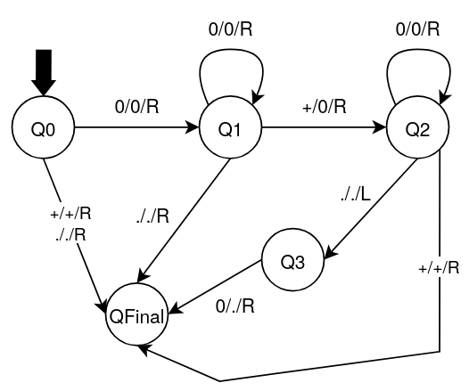

# Unary Addition Turing Machine

A Turing machine implementation that performs addition of two numbers represented in unary format.

## Overview

This Turing machine adds two numbers represented in unary notation (where a number *n* is represented by *n* consecutive '0's). The input format is `0...0+0...0` and the machine produces the sum as a continuous string of '0's.

For example:
- Input: `00+000` (2 + 3)
- Output: `00000` (5)

## Machine Specification

- **Input alphabet**: `[0, +]`
- **Blank Symbol**: `[.]`
- **Alphabet**: `[0, +] + [.]`
- **Initial State**: `q0`
- **Final States**: `HALT`
- **States**: `q0, q1, q2, q3, HALT`

## State Descriptions

- **q0**: Initial validation state - ensures the input starts with '0' (rejects empty input or input starting with '+')
- **q1**: Traversal state - moves right through the first number, looking for the '+' operator or end of tape
- **q2**: Second number traversal - moves right through the second number after converting '+' to '0', looking for the end of the tape
- **q3**: Cleanup state - removes the last '0' from the tape to maintain the correct count after merging the two numbers
- **HALT**: Accepting final state - computation completed successfully

## How It Works

1. **Validation** (q0): Ensures the input starts with '0' (not empty or starting with '+')
2. **Find Operator** (q1): Moves right through the first number until finding the '+' sign
3. **Convert Operator** (q1 → q2): Replaces the '+' with '0', effectively "merging" the two numbers
4. **Find End** (q2): Moves to the end of the second number
5. **Remove Last Zero** (q3): Deletes the last '0' to maintain correct count
6. **Result**: The tape now contains the sum in unary format

### Why This Works

In unary addition: `n + m` zeros = `(n + m)` zeros

The algorithm:
- Converts `0...0 + 0...0` (n zeros, plus sign, m zeros)
- Into `0...0 0 0...0` (n zeros, one zero, m-1 zeros)  
- Which equals `(n + 1 + m - 1) = (n + m)` zeros

By replacing '+' with '0' and removing one '0' from the end, we get the correct sum!

## State Transition Diagram

## Transition Table

| Current State | Next State | Read Symbol | Write Symbol | Move Direction |
|:-------------:|:----------:|:-----------:|:------------:|:--------------:|
| q0 | q1 | 0 | 0 | RIGHT |
| q0 | HALT | + | + | RIGHT |
| q0 | HALT | . | . | RIGHT |
| q1 | q1 | 0 | 0 | RIGHT |
| q1 | q2 | + | 0 | RIGHT |
| q1 | HALT | . | . | RIGHT |
| q2 | q2 | 0 | 0 | RIGHT |
| q2 | HALT | + | + | RIGHT |
| q2 | q3 | . | . | LEFT |
| q3 | HALT | 0 | . | RIGHT |

## Input Format Requirements

### Valid Inputs
- `0+0` → Addition of two numbers
- `00+000` → Multi-digit unary addition
- `0` → Single number (no addition performed)
- `000` → Single number

### Invalid Inputs (REJECT)
- `+00` → Starting with operator
- `.` → Empty input
- `00++00` → Multiple operators
- `00+` → Missing second operand

## Usage

To run this Turing machine:

1. Load the `unary_addition.json` configuration file
2. Provide input in the format `0...0+0...0` (unary numbers separated by '+')
3. The machine will:
   - Validate the input format
   - Compute the sum
   - Output the result in unary format
   - Halt in `HALT` state for valid and invalid input

## Unary Number System

In unary notation:
- 1 is represented as `0`
- 2 is represented as `00`
- 3 is represented as `000`
- n is represented as n consecutive '0's

This is the simplest positional numeral system, but also the least space-efficient.
